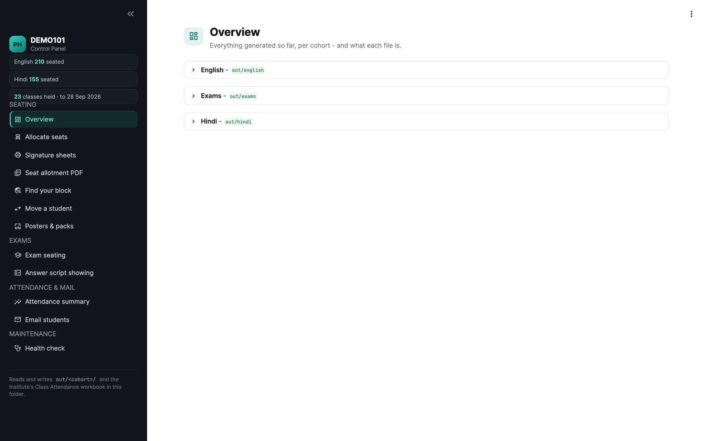
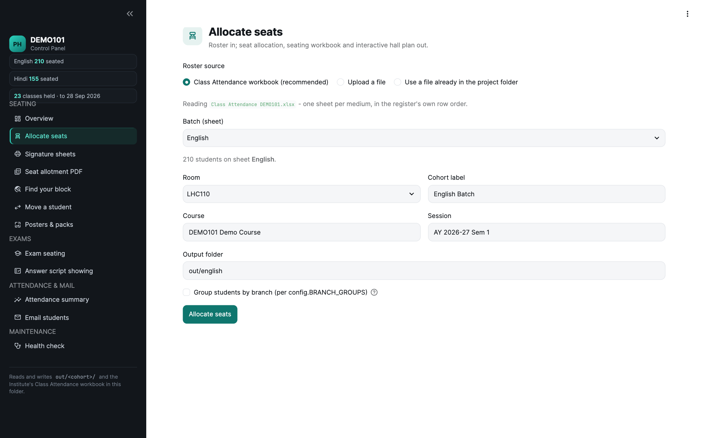
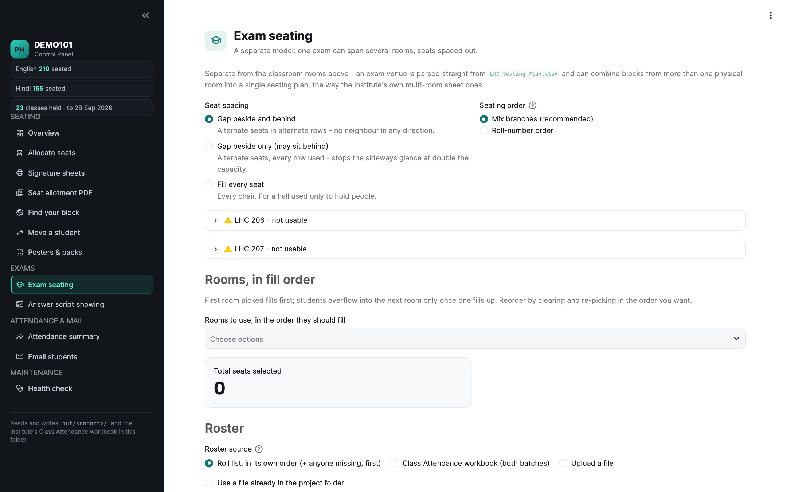
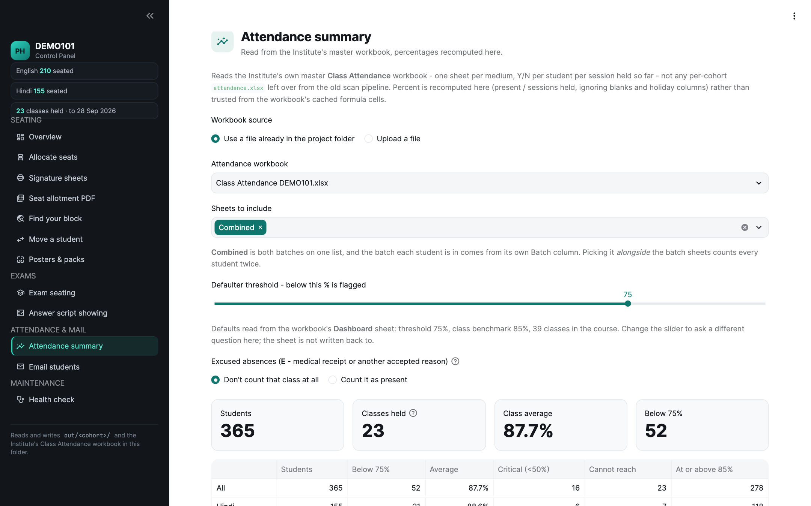
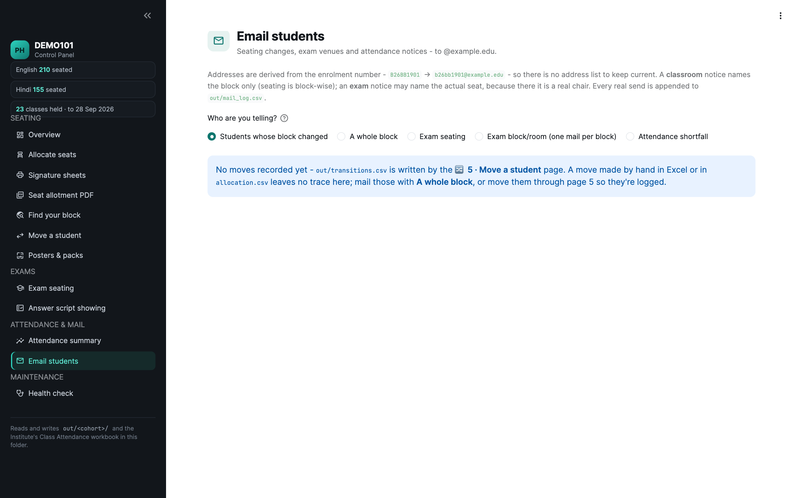
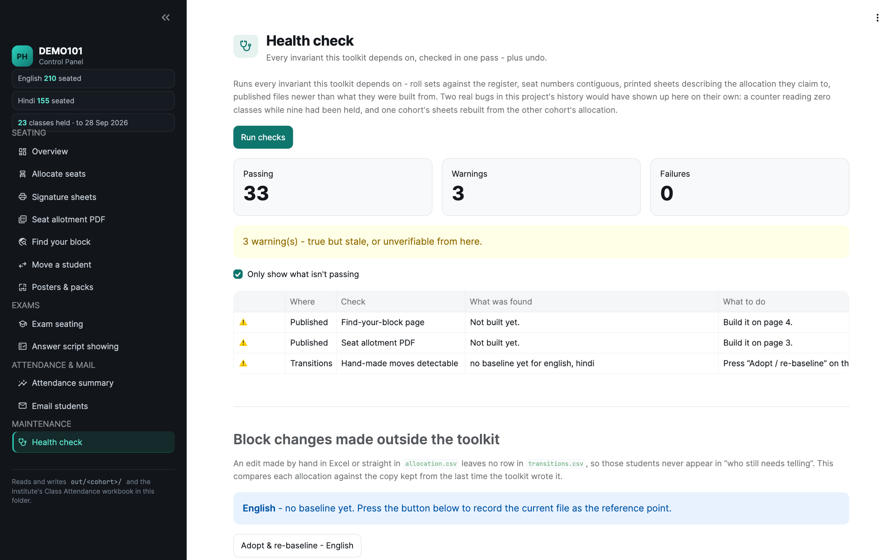

# Course Attendance & Seating Dashboard

[](https://github.com/kkreboot/course-attendance-dashboard/actions/workflows/tests.yml)
[](LICENSE)
[](https://course-attendance-dashboard.streamlit.app)

A Streamlit dashboard and Python toolkit for running attendance, classroom
seating, exam seating and student mail for one large course. It works for
any course: the course code, title, session, institute, mail domain and
instructors are one block in `config.py`. It grew out of running a
~365-student first-year course taught in two batches in two halls, and the
demo (`DEMO101`) reproduces that scale with invented students.

**Live demo:** <https://course-attendance-dashboard.streamlit.app> (invented
data; mail can be composed and rehearsed but never sent).

## Features

- **Classroom seating**: allocate a batch to the blocks of a hall, grouped by
  branch, then print per-block signature sheets, a seating workbook and an
  interactive hall plan.
- **Exam seating**: spaced seating across several rooms, seat maps for the
  notice board, a printable invigilator pack and TA duty postings.
- **Attendance**: percentages and the below-threshold list read straight from
  the register workbook, a per-batch trend chart against the threshold, an
  **at-risk forecast** (students still above the line who would drop below it
  by missing the next few classes), and a PDF report for handing over.
- **Student lookup**: one student's classroom seat, exam seats, class-by-class
  attendance, moves and mail on one page, with a summary to paste into a reply.
- **Student mail**: seating, exam and attendance notices composed per student
  or per block, sent over SMTP or handed off to Gmail compose windows.
- **Self-lookup pages**: "find your block" and "find my seat" pages that are
  safe to publish (roll numbers hashed, no names).
- **Print bundle**: every printable for a batch or an exam in one ZIP, with a
  manifest that flags anything built before the seats last changed.
- **Safety net**: snapshots before every write, a health check over every
  invariant, and a test suite run on every push.

## Screenshots

| Overview | Allocate seats |
|---|---|
|  |  |
| **Exam seating** | **Attendance summary** |
|  |  |
| **Email students** | **Health check** |
|  |  |

## Use it for your course

Open the dashboard and fill in **Maintenance › Course setup** once. On a
fresh folder it opens there by itself. It asks for the course (code, title,
session, dates, classes planned), the institute and student mail domain, the
instructors, you as the TA who signs the mail, the attendance rules
(threshold, benchmark, when notices go out, what an excused absence counts
as), the classroom halls block by block, and your workbooks. Everything is
saved in `course_settings.json` in the project folder, and every page, sheet,
poster, PDF and mail reads it from there. No Python to edit. The full
checklist is under [Set it up for your course](#set-it-up-for-your-course).

## Try it in two minutes (sample data)

**No real student data ships with this repository.** Every workbook the
dashboard reads is generated by `make_sample_data.py`: invented names,
roll numbers in the right *format* but with serials no real batch uses, TAs
called "TA 01" to "TA 21", and attendance marks drawn from a seeded random
generator. The layouts are the real ones, so every page and test runs
unchanged.

```bash
python3 -m venv .venv && . .venv/bin/activate
pip install -r requirements.txt
python make_sample_data.py      # sample_data/ -> project root, then builds out/
streamlit run dashboard.py
```

`make_sample_data.py` never overwrites a workbook already in the project
root, so it is safe to run next to your own files (`--force` replaces them,
`--regenerate` rebuilds `sample_data/` from its seed).

## Set it up for your course

Everything is on the **Course setup** page (sidebar › Maintenance), in five
tabs, saved with one button:

1. **Course.** Code and title (for example `PHY101`, `Mechanics`), session,
   first and last class, classes planned. The workbook names follow the code;
   change the code later and the workbooks already in the folder are renamed
   to match.
2. **Institute & people.** Institute, short name, department, the student
   mail domain (mail goes to `<roll>@domain`), the public lookup URL if you
   publish one, the instructors (printed on every sheet, Cc'd on every mail),
   and your name, roll number and email for the mail signatures.
3. **Attendance rules.** Requirement (75%), class benchmark, the absences
   that trigger each notice (5, 9, 13), and whether an excused absence is left
   out or counted as present.
4. **Halls.** One row per block: hall, block letter, rows, seats per row, the
   wedge rows behind it, front or rear; plus the optional branch grouping.
5. **Files.** Upload the register, roll list, TA duty workbook and exam-hall
   plan. Each is checked the way the page that uses it reads it, then saved
   under the name the dashboard expects (see `sample_data/` for the layouts).

Every save is validated first (nothing is written if a value is wrong) and
snapshots the previous settings and any file it replaces. The health check
warns while settings are missing or still hold demo values.
`course_settings.json` is git-ignored: it holds real names and addresses.

`.gitignore` keeps every spreadsheet, CSV, PDF and `out/` in the project root
out of git, so real student data cannot be committed by accident; only
`sample_data/` is tracked.

| File (project root, `<CODE>` = `COURSE_CODE`) | What it is |
|---|---|
| `Class Attendance <CODE>.xlsx` | The register: one sheet per batch, a `Combined` sheet, a `Dashboard` sheet |
| `<CODE>_TA_Duty_Assignment.xlsx` | TA duties, plus the answer-script showing schedule |
| `student_rollList-<CODE>.xlsx` | The department's roll-list export (exam roster order) |
| `LHC Seating Plan.xlsx` | Exam-hall geometry (seat numbers only, no people) |

## Deploy your own demo (Streamlit Community Cloud)

Fork the repo, then at <https://share.streamlit.io> choose **Create app**,
pick the fork, branch `main`, main file `dashboard.py`, and under Advanced
settings Python 3.12. On first start the dashboard installs the invented
workbooks from `sample_data/` (never over an existing file). With no SMTP
secrets set, sending stays disabled: mail is composed, previewed and
rehearsed only.

## Overview

Two commands. `plan` allocates seats, `sheets` prints the signature sheets
students sign in class. Attendance itself is kept in the Institute's master
**Class Attendance** workbook, which the dashboard summarises.

That workbook - `Class Attendance <CODE>.xlsx` - is also the
**primary roster**: one sheet per medium, kept current by the department, so
it stays right about who is in which batch when a Section & Group export does
not. Seats follow its row order within each block, so a signature sheet read
top-to-bottom matches the register read top-to-bottom, and marking attendance
off a sheet needs no hunting.

Fixed seating is what makes 350 students tractable: every student has one
known seat, so a signed row against an empty seat is visible to whoever is
invigilating, and the printed sheet doubles as the seating record.

> The automatic scanner (ArUco-marked sheets, ink scoring, `run.py scan`) was
> removed. Sheets are now plain, and sessions are recorded by hand in the
> Class Attendance workbook.

Course instructors are set once in `config.py` (`COURSE_INSTRUCTORS`), name
and address together: **Dr. Instructor One** and **Dr. Instructor Two**.
The names print on the exam packs, signature sheets, seat allotment PDF, hall
posters and both exam pages, and the same entry supplies the Cc list on every
mail the toolkit sends.

## Tests

```bash
.venv-$(uname -s)/bin/python -m pytest tests -q
```

The suite always runs on the demo course (it points `COURSE_SETTINGS_FILE`
at a file that doesn't exist), so run it in a clone with the sample data, not
in the folder holding your course's workbooks.

167 tests over the rules that matter (run `python make_sample_data.py` first): seats stay contiguous and inside their
block, a reorder never moves anyone between blocks, wedge seats stay reserved
unless asked for, a transition mail can never name a seat, nobody is mailed
the same escalation level twice, snapshots round-trip, and drift detection
reports nothing when it has no baseline.

## Install

```bash
pip install -r requirements.txt
```

## Dashboard

A single Streamlit control panel wraps all three commands - no CLI flags to
remember:

```bash
streamlit run dashboard.py
```

**Windows, one click:** double-click the **"<CODE> Dashboard"** shortcut on
the Desktop (or `launch_dashboard_chrome.bat` directly). It starts the
server in the background, headless, then opens it in Chrome once the port
answers - no terminal typing. First time on a machine, run `setup.bat` once.

**macOS, one click:** `./setup.sh` once - it installs **<CODE> Dashboard.app**
into `~/Applications`, so you can launch it from Spotlight (type the course code) or
drag it to the Dock. It opens a small Terminal window while the server starts,
then the dashboard appears in your browser.

**macOS / Linux, one command:** `./setup.sh` once, then
`./launch_dashboard.sh` (Linux also gets a Desktop launcher). The venv is
per-OS - `.venv-Darwin` / `.venv-Linux` / `.venv-Windows` - because this
folder is Dropbox-synced across all three machines and a venv can't be
shared between them.

Everything is reached from the **sidebar**, grouped into Seating, Exams, and
Attendance & mail. Above the nav, a status strip shows - on every page, at a
glance - how many students are seated per batch, how many classes are
recorded so far (and up to which date), and, highlighted in amber, how many
students have moved block but not yet been told. The interface uses Inter, Material Symbols icons and a teal accent taken from
the course's own block colours, with **full light and dark themes** - switch
in the ⋮ menu (top right) → Settings, or let it follow your system. Charts are
drawn in the same block colours as the hall plan and the printed sheets.
Everything visual lives in `.streamlit/config.toml`. Only the page you're on runs, so opening the dashboard no longer
reads every workbook every section would touch.

- **📋 Overview** - every cohort under `out/`, with student counts, **classes
  held** (read from the master Class Attendance workbook, counting only
  sessions that have marks - not the retired per-cohort `attendance.xlsx`),
  sheet status, and one-click previews & downloads of what's been generated.
- **🪑 1 · Allocate seats** - upload a roster (or pick one already in the
  project folder), choose room/medium/cohort, and get the allocation,
  seating workbook, and interactive hall-plan HTML. Optional **"Group
  students by branch"** (`config.BRANCH_GROUPS`, from
  `config.BRANCH_GROUPS`): seats each block's assigned branches
  together instead of plain roll order - a block with no branches assigned,
  and any student whose branch isn't listed anywhere (including backlog
  students, who are never split by branch - the source data only gives a
  lump total per backlog admission year, not a branch breakdown), falls
  through to the same front-to-rear catch-all fill plain allocation uses.
  Currently defined for `LHC110` and `LHC2 101` only; `--group` on the CLI
  does the same thing (`seating.allocate_grouped`).
- **🖨️ 2 · Signature sheets** - build the signature PDFs from an
  allocation (just-generated or an existing `allocation.csv`), optionally
  merged into one combined PDF. Prints the Attendance TA's name on the
  sheet if given - type one in directly, or auto-fill it from a TA duty
  file (`finder.ta_schedule`/`ta_for_date`) by date + Morning/Afternoon
  slot, same weekday-based lookup the "Add Attendance TA Name" row on the
  Class Attendance workbook uses. `--ta` on the CLI does the same thing.
  No TA name given prints exactly as before - the extra line only appears
  when there's something to put in it.
  **"Show each student's attendance %"** adds an Attendance column showing
  where each student stands up to the last class that has marks in the Class
  Attendance workbook (`56%  5/9`), with the as-of date printed on every
  page - print these for the next class and each student sees their standing
  as they sign. Students missing from the chosen batch sheet print `-`
  rather than a wrong number. Leave it unticked and the sheet is exactly the
  four-column one as before. Note that a signature sheet is passed along the
  row, so a student's neighbours can read their percentage; the 📧 tab's
  attendance mail says the same thing privately if that matters.
- **🧾 3 · Seat allotment PDF** - the plain student-facing PDF (`handout.py`):
  one block-map page plus the full roll-number roster, grouped by block.
  Pick any combination of cohorts' allocations to combine into one file -
  this is what produces documents like `<CODE> Seating.pdf`. Each cohort
  can be set to a Morning/Afternoon Attendance-TA slot; give a TA duty file
  and the block-map footer prints that cohort's whole Mon/Wed/Fri weekly
  roster instead of the generic "ask a TA" note - this PDF has no single
  date to look one TA up against, so it shows the full weekly rotation
  rather than one name. No slot or file given prints exactly as before.
- **🔎 4 · Find your block** - builds the shareable self-lookup page
  (`finder.py`, → `find-your-block.html`): a student types their roll number
  and gets their block, highlighted on the hall plan; a TA types theirs and
  gets their duty assignment instead (`<CODE>_TA_Duty_Assignment.xlsx` via
  `finder.load_tas`). Roll numbers are stored as hashes, never in plain
  text, and no names are embedded for either - the page is safe to host
  publicly. Auto-discovers a TA file in the project folder if one's there
  (skipping anything with "template" in the name - `LHC110_TA_Duty_Template.xlsx`
  is a blank example, not real data).
- **🔀 5 · Move a student** - moves one student into a vacant *core* seat
  (`seating.move_student`) - same room, a different block, or a different
  room entirely (a batch transfer). Wedge/extra seats stay in reserve, same
  convention initial allocation uses. Regenerates the seating workbook,
  hall-plan HTML, and signature sheets (optionally re-merged into one PDF)
  for every room that changes - so the printed sheets always match who's
  actually assigned where. Attendance already recorded under a student's old
  seat is **not** retroactively moved; only sessions after the move
  reflect it. Re-run tabs 3/4 afterwards if you also want the seat allotment
  PDF and find-your-block page refreshed. Every move is appended to
  `out/transitions.csv`, which is what the 📧 tab reads to work out who still
  needs telling - a move made by hand in Excel isn't recorded there and won't
  show up in that list.
- **🖼️ Posters & packs** - a **notice-board seat map** (one sheet per room, the
  whole room drawn as it is laid out, for the board outside the hall: A3 for
  LHC 110 and 308, A4 for the smaller rooms), an A4 hall-door poster (lookup URL, QR code, block
  map with student counts) and an exam **invigilator pack**: per room, the
  seat grid with roll numbers in position, then a signature list.
- **🩺 Health check** - runs every invariant the toolkit depends on (roll sets
  against the register, contiguous seat numbers, printed sheets matching the
  allocation, published files newer than their sources) and shows what isn't
  passing. Also finds block changes made by hand outside the toolkit, and
  holds the **snapshot list** - every build saves what it overwrites first, so
  a bad build is one click to undo. Runnable headless too: `python checks.py`.
- **📧 Email students** - mails students (`mailer.py`). Four audiences:
  **Students whose block changed** (the default - reads
  `out/transitions.csv`, the log of every move made in tab 5, and offers only
  those who actually changed block and haven't been told about *that* move
  yet), **A whole block** (a first announcement to everyone in it),
  **Exam seating**, **Exam block/room** - one mail per block in every room, naming
  room and block (the seat is on the door sheet), students in To, instructors
  in Cc and that block's TAs in Bcc - or **Attendance shortfall** - scans the master Class
  Attendance workbook, finds everyone who has missed more than N classes
  (default 4, i.e. 5 absences and up), and writes to each of them in the
  course's agreed wording, with **both course instructors in Cc**
  (`instructor.one@example.edu`, `instructor.two@example.edu` - editable per send).
  **Escalation mode** switches from a single limit to levels (5 / 9 / 13
  absences); each student is written to once per level, tracked in the mail
  log, so nobody gets the same notice twice and nobody is skipped when they
  slip to the next one.
  Only the name and the missed-session count vary between the messages; the
  present/held/percent figures shown in the dashboard table are for your
  check and stay out of the mail. Sent one window per student, never merged
  into a shared Bcc, since each carries that student's own record. Two delivery routes, picked per send: **Open in Gmail**
  (no setup - see below) or **Send directly from here (SMTP)**.
  Addresses come from the enrolment number - `B26BB1901` →
  `b26bb1901@example.edu` - so there is no address list to maintain. Two kinds
  of notice: a **seating block** notice for the classroom, which names the
  block and *never* a seat number (seating is block-wise, so a seat id would
  be wrong), and an **exam seating** notice, which may name room, block and
  seat because an exam seat is a real chair. Pick blocks (or individual
  students) from a cohort, or carry over the allocation you just made in the
  Exam seating tab. Every send starts as a **dry run** - you see the exact
  message and the recipient list before anything leaves the machine - and real
  sends are appended to `out/mail_log.csv`. The **🔀 5 · Move a student** tab
  offers the same thing for the one student it just moved.
  **Open in Gmail** needs nothing configured and is the route that works on an
  Institute account whose admin has disabled app passwords. Each window gets
  its own button with a `sent` tick box next to it - tick one and it drops off
  the list, so a long run of one-per-student mails stays countable
  ("3 of 14 marked sent") instead of you losing your place. It opens Gmail's
  compose window, already filled in, in whichever Google account you name -
  you read it and press Send. Students go in **Bcc**, so none of them sees
  another's address, and a whole block fits in one window when the message is
  addressed generically ("Dear student"); long batches are split across
  several windows rather than silently truncating the recipient list. Because
  the sending happens in Gmail, `out/mail_log.csv` records those as
  `handed-off`, never `sent` - Gmail's own Sent folder is the real record.
  SMTP is configured through the environment (`COURSE_SMTP_HOST`,
  `COURSE_SMTP_USER`, `COURSE_SMTP_PASSWORD`, `COURSE_SMTP_FROM`, …;
  optional `COURSE_MAIL_BCC` for an office copy) - copy
  `mail_config.example.json` to `mail_config.json` for everything except the
  password, which stays an environment variable so it never syncs through
  Dropbox.
The workbook uses three marks - **Y** present, **N** absent, **E** *excused*
absence (medical receipt or another accepted reason) - plus **N/A** for a
class that doesn't apply to a student at all, such as the weeks before a late
admission joined. An `E` is never counted
as an absence, so it can never trigger a shortfall notice; whether it drops
out of the percentage or counts as present is a choice on the Attendance
summary page.

Each exam also produces a **printable pack (PDF)**: a cover with the full
invigilation table, seat grids with roll numbers in position, and
signature sheets with a present / absent / scripts-collected tally at the
foot. **LHC 110 and LHC 308 print block by block** - each block has its own
invigilator, so its own grid page and its own sheet; **every other room prints
room-wise**, since two TAs cover the whole room and five sheets of eight
students is five things to lose. TAs are posted by the course's own
rule - one per front block, two per long back block, two per smaller room, all
three adjustable per exam -
either **automatically** from the duty sheet (Evaluation TAs first, heads
last) or **manually**, post by post. Off-block jobs are posted the same way:
**two TAs take responsibility for printing the question papers**, never the
heads, and preferably someone without a block to stand in. The **two TA
heads** get their own section on the pack - paper custody, invigilator briefing, script
collection and irregularities for the Evaluation Head; seating lists and the
absentee list for the Attendance Head. The Evaluation Head is marked overall
in charge of every exam, quizzes included.

Venues come from `LHC Seating Plan.xlsx`, plus any room defined in
`exam_rooms.EXTRA_ROOMS`: **LHC 105** (LHC 206 and 207 merged, ten rows of
fifteen, 150 seats) is defined there rather than by editing the Institute's
own workbook. The notice-board map offers **A4 only** as well as its usual A3,
splitting a big hall over numbered A4 sheets rather than shrinking it.
**LHC 105 is numbered by row and column, not by block** - a seat
there is "Row 3, Column 7" on every sheet, page and mail, while LHC 110 keeps
its block letters, since a block there is a place an invigilator stands in. LHC 206 and 207 are no longer offered as venues; they stay in
the list marked with what replaced them.

Exam rosters come from the **Class Attendance workbook** by default - the
department's live list, which a roll-list export can lag behind by a late
admission.

Exams are saved, not just downloaded: each one lands in
`out/exams/<exam>/` with its allocation, an **interactive seat map** for
invigilators (every room drawn to scale, roll numbers in position, search to
spotlight one) and a **find-my-seat page** for students (roll numbers hashed,
no names, safe to put behind a QR code). Wedge/transition seats are held back from exams as they are from classes -
unless one or two students would otherwise be left over, in which case they
are used rather than opening another room, and flagged on the map.
Three spacing methods can be chosen per exam - a gap **beside and behind**
(alternate seats in alternate rows), a gap **beside only** (every row used, so
a student may sit behind another), or **every seat filled**. Seats can also be
dealt so that neighbours are rarely from the same branch, and the term's scheduled
exams - **Quiz 1, 31 August 2026**, **Minor, 16 September 2026** and **Major,
21 November 2026**, all sat by both batches together - are prefilled.

- **📊 Attendance summary** - reads the Institute's own master **Class
  Attendance** workbook (`attendance_report.py`, one sheet per medium, a
  date + `Cn`/`N/A` header per column, Y/N per student per session held
  so far) - a different, canonical file from any per-cohort
  `out/<cohort>/attendance.xlsx` the retired scan pipeline left behind;
  the two aren't reconciled against each other. Percent is
  recomputed in Python (present / sessions held, ignoring blank and
  holiday columns) rather than trusted from the workbook's cached formula
  cells, so it's correct even right after a hand edit Excel hasn't
  resaved yet. Shows class-average and per-session trend, a defaulter
  list below an adjustable threshold (default 75%), and a full per-student
  summary - both downloadable as `.csv`. Auto-picks the workbook from the
  project folder if there's exactly one unambiguous match (skipping
  anything with "backup" in the name).
- **🧑‍🎓 Exam seating** - a deliberately separate model from
  the classroom rooms above (`exam_rooms.py`). **Naming note, confirmed by
  hand:** the source sheets originally used two different prefixes for the
  same physical building - everything is now normalized to "LHC" for
  clarity, so `LHC110` (the classroom room above) and `LHC 110` (an exam
  venue below) are very likely the same physical room 110, just two
  independent spreadsheets for two different purposes. **"LHC2"** (`LHC2_101`)
  is a **different, unrelated building** despite the similar
  name - don't confuse it with "LHC" here.
  Exam venues are parsed live
  from `LHC Seating Plan.xlsx`, and one exam can combine blocks from more
  than one physical room into a single seating plan. `LHC 206`, `LHC 207`,
  `LHC 304`, `LHC 306`, and `LHC 307` are five separate rooms with identical
  seating capacity - the workbook's `LHC 206 207 304 306 307` sheet draws one
  room's full 5-block layout (blocks A-E, 15 seats each, 75 seats / 40
  spaced), and that same layout applies to all five rooms, so each gets its
  own independent copy of it rather than one block per room. Each is
  pickable independently and combinable with any other room for one exam -
  and in whatever order you pick them in: rooms fill in the order selected,
  overflowing into the next only once the current one is full, and blocks
  within a room fill in the order picked there too. Seats
  default to alternate-row/alternate-seat spacing, matching the Institute's
  own quiz template, with a toggle to fill every seat instead. Output is the
  Institute's own roll-list format (header block + S.No/Roll/Name/Room/Block
  ID/Seat No./Attendance - a `Room` column since one exam can span several),
  plus a second "Layout" sheet: a bordered, labelled matrix per block -
  column numbers across the top, "Row N" down the side, roll numbers in
  position and "-" for a seat that exists but wasn't allotted. A block only
  known by its *total* (LHC 110's back section, or LHC's flat 15-seat row)
  gets wrapped into a proper grid (15 seats wide) rather than one very long
  row, so every block reads as an actual matrix, not just a numbered list.
  Rosters
  aren't limited to the Section & Group format either - `load_roster` now
  auto-detects the sheet and header row when they don't match the default,
  so a plain Institute export like `student_rollList-<CODE>.xls` (single
  sheet named "Subject Roll List", header on row 3, no Program/Group/Medium
  columns) works directly with no manual sheet/header tweaking.
  `LHC 110` (blocks A-D front, E-G back, 586 seats) is usable too, per the
  Institute's own updated total-capacity sheet (`LHC110.xlsx` / `Sheet2`).
  Its template only ever drew one sample row of boxes per block - nowhere
  near the real per-block totals (36/50/54/36 front, 140/130/140 back) - so
  each block's total is encoded directly in its header, e.g.
  `Block ID - E (140)`, rather than fabricating a row-by-row layout the
  source data doesn't provide (`exam_rooms.py`'s parser understands this
  format alongside LHC 308's sparse "start…end" row convention).

## Gmail SMTP (optional - unattended sending)

**You do not need any of this to mail students.** The **Open in Gmail** route
in the 📧 tab pre-fills a compose window and you press Send; that is the
recommended path on an `@example.edu` account, because Workspace admins
commonly disable app passwords, and without one there is no way to
authenticate SMTP at all. Check
<https://myaccount.google.com/apppasswords> - if it says the option isn't
available for your account, stop here and use the Gmail hand-off.

What SMTP buys, if it is available: the dashboard sends the whole batch
itself, unattended, with a per-recipient result and a real `sent` row in
`out/mail_log.csv` for each. Setup, once per machine:

**1. Turn on 2-Step Verification** on the sending account
(<https://myaccount.google.com/security>). Google will not issue an app
password without it. On an Institute Workspace account, if 2-Step
Verification or app passwords are disabled by the admin, ask IT - Gmail has
not accepted a plain account password over SMTP since 2022, so there is no
way around this.

**2. Create an app password** at
<https://myaccount.google.com/apppasswords> - pick "Mail" / "Other", name it
something like `course dashboard`. You get a 16-character code shown once.
It is *not* your Google password: it only sends mail, and you can revoke it
from that same page without touching the account.

**3. Put the settings where the dashboard will find them.** Easiest way -
it prompts for each setting, reads the password with the screen echo off, and
writes the file at mode 600, so the password never touches your shell history
or the process list:

```bash
python3 mailer.py --configure
```

Or write it by hand. Either way it is `~/.course_dashboard_smtp.env`, in your **home**
directory, deliberately *not* in this project folder, which Dropbox syncs to
every machine:

```bash
cat > ~/.course_dashboard_smtp.env <<'EOF'
COURSE_SMTP_HOST=smtp.gmail.com
COURSE_SMTP_PORT=587
COURSE_SMTP_USER=you@example.edu
COURSE_SMTP_PASSWORD=abcdefghijklmnop
COURSE_SMTP_FROM=you@example.edu
COURSE_SMTP_FROM_NAME=PHY101 Course Office
EOF
chmod 600 ~/.course_dashboard_smtp.env
```

The app password goes in with or without Google's display spaces - both work.
On Windows the same file is `%USERPROFILE%\.course_dashboard_smtp.env`, same
`KEY=value` lines (create it in Notepad; make sure Notepad doesn't append
`.txt`).

This file is read by `mailer.py` itself, so it works no matter how the
dashboard was started - Spotlight, the Desktop shortcut, the `.desktop`
launcher, or `streamlit run dashboard.py` in a terminal. A shell `export`
only reaches the last of those, which is why the file exists.

**4. Check it with a real message to yourself**, before any student is
involved:

```bash
python3 mailer.py --to you@example.edu --send
```

That composes one sample block-transition notice, prints it, tests the
connection, and sends it to the address you gave - drop `--send` to stop at
the connection test. `--kind exam` sends the exam-seating version instead.
The dashboard's own **Test SMTP connection** button (in **📧 Email students**)
does the connection half of the same check; `Authenticated as …` means done.
Common failures:

| Message | Cause |
|---|---|
| `SMTPAuthenticationError: 535 … BadCredentials` | Using the account password, not an app password - or a typo in the 16 characters. |
| `SMTPAuthenticationError: 534 … Application-specific password required` | 2-Step Verification is on but you gave the account password. |
| `SMTPServerDisconnected` / timeout on port 587 | Network blocks outbound SMTP (some campus/hostel networks do). Try `COURSE_SMTP_PORT=465`, which switches to implicit SSL automatically. |
| `Not configured: COURSE_SMTP_…` | The file isn't where `mailer.py` looks, or a line has a stray quote. |

**Alternatives to the env file.** Anything non-secret can instead live in
`mail_config.json` in the project folder (copy `mail_config.example.json`) -
the password is *ignored* there on purpose, since that file would sync. Or
export the variables in the shell before `./launch_dashboard.sh`, if you
always start it from a terminal. Precedence is environment →
`~/.course_dashboard_smtp.env` → `mail_config.json`.

**Before mailing a whole batch:**

- **`COURSE_MAIL_BCC=you@example.edu`** keeps a copy of every notice in your
  own mailbox - worth having when a student says they were never told.
- **The `From` address must be the account you authenticated as**, or an
  alias Gmail has verified for it. Gmail silently rewrites anything else, so
  a made-up sender address doesn't do what it looks like it does.
- **Gmail caps sending**: roughly 500 recipients/day on a personal account,
  2000 on Workspace. A 208-student English batch fits; both batches plus
  retries in one day may not. `mailer.send_mails` pauses ~0.4 s between
  messages, which also keeps Gmail from treating the burst as spam.
- **Send yourself a real one first** - set the block selection to a single
  student (yourself, or a test roll), untick **Dry run**, send, and read what
  actually arrives before doing this to 200 people.
- **`out/mail_log.csv` is the record** of who has been told what. Check it
  before re-sending to a block; a real send appends one row per recipient,
  a dry run writes nothing.


## Run

Two batches, two halls. English sits in LHC-110, Hindi in LHC2 101.

```bash
R=Section_Group.xlsx

# English batch -> LHC-110
python run.py plan   --roster $R --medium English --cohort "English Batch" \
                     --room LHC110 --out out/english
python run.py sheets --roster $R --medium English --cohort "English Batch" \
                     --room LHC110 --out out/english/sheets

# Hindi batch -> LHC2 101
python run.py plan   --roster $R --medium Hindi --cohort "Hindi Batch" \
                     --room "LHC2 101" --out out/hindi
python run.py sheets --roster $R --medium Hindi --cohort "Hindi Batch" \
                     --room "LHC2 101" --out out/hindi/sheets
```

Keep the two output folders separate, so the English and Hindi sheet sets
never overwrite each other.

## The two commands

```bash
# 1. Allot blocks, build the workbook and the interactive hall plan
python run.py plan --roster roster.xlsx --out out/english

# 2. Print the signature sheets (one PDF per block)
python run.py sheets --roster roster.xlsx --out out/english/sheets --date "07 Aug 2026"
```

Step 2 repeats whenever the roster or the seating changes; `template.json`
written alongside the PDFs is what the dashboard discovers cohorts by.

## When the Hindi roster arrives

Nothing changes. Point the same commands at the new file:

```bash
python run.py plan   --roster roster_hindi.xlsx --cohort "Hindi Batch" --out out/hindi
python run.py sheets --roster roster_hindi.xlsx --cohort "Hindi Batch" --out out/hindi/sheets
```

If the Hindi students are rows inside a combined roster, filter instead of
splitting the file: `--medium Hindi`. If they sit in a different hall, add the
room to `ROOMS` in `config.py` and pass `--room`.

Generate the two cohorts into **separate output folders** so one cohort's
sheets never overwrite the other's.

## TA duty roster

```bash
python run.py duty --tas ta_list.txt \
                   --head P24PH0999:English --head P24PH0998:Hindi \
                   --attendance-n 10 --english-share 0.70 --blocks 7 \
                   --seed 20260807 --out out/ta_duty.xlsx
```

Every TA holds **exactly one** duty. Heads are named and excluded from the draw.
Everyone else is shuffled; `--attendance-n` of them take attendance and the rest
evaluate answer sheets. Each pool is then dealt English / Hindi at
`--english-share`.

Change `--seed` to re-roll. The same seed always reproduces the same roster,
which is what makes a random draw defensible in a meeting.

`ta_list.txt` is one `roll<TAB>name` per line.

## Roster format

Any `.xlsx` with a header row containing a roll-number column. Column names are
matched case-insensitively against common variants (`Student Rollno`, `Roll No`,
`Roll`; `Student Name`, `Name`; `Program`/`Branch`; `Group`; `Language`/`Medium`).
Use `--sheet` and `--header` if the tab name or header row differs. Duplicate
roll numbers abort the run - that is deliberate, since a duplicate would make
two students share one signature box.

## How blocks are allotted

Default mode is `--mode block`: a student is allotted a **block**, not a chair,
and sits anywhere inside it. Blocks fill in room order by roll number, each to
its seated capacity, so a cohort occupies the fewest blocks it can and the rest
of the hall stays wholly clear.

Wedge seats and extra chairs are **never** allotted. They are the transition
pool for late admissions and medium transfers.

`--mode seat` allots a numbered chair instead, and adds a `Transition seats` tab
plus per-seat codes on the signature sheets. Use it if you later need to know
exactly who sat where.

## Halls

| Room | Blocks | Seated | Extra chairs |
|---|---|---|---|
| `LHC110` | A–D front (6 wide), E–G rear gallery (10 wide) | 566 | 20 wedge |
| `LHC2 101` | A–D, 4 columns x 11 rows each | 176 | 16 |

Both are plain lists of `Block` objects in `config.py`. Add a hall by adding a
list and an entry in `ROOMS`.

**LHC2 101 assumption worth checking:** the room plan says "Block A - 44" with an
`Extra Chair` row above it, so 44 is read as the seated count (4 columns x 11
rows) with 4 extra chairs on top, giving 48 per block. If 44 is meant to include
the extra chairs, change `LHC2_101` in `config.py` to `Block("A", ..., 10, 4, (4,))`.

## Printing the sheets

- Print at **100% scale**. "Fit to page" shrinks the sheet and the columns stop
  lining up with the hall plan.
- One PDF per block, 26 rows a page, seats in the same order as the plan, so a
  sheet can be handed straight to the block it belongs to.
- The signature box rules print in light cyan so a signature stays legible
  against them.

## What this cannot do

Signature sheets record **a signature in a box**, not identity. A student who
signs for an absent friend passes. Fixed seating is what makes that visible -
an empty seat whose row is signed is a human check, not a code one.

## Files

| File | Role |
|---|---|
| `config.py` | Hall geometry and sheet layout. Edit this first. |
| `seating.py` | Roster loading, seat map, allocation. |
| `reports.py` | Seating workbook and interactive hall plan. |
| `sheets.py` | Signature-sheet PDFs and `template.json`. |
| `attendance_report.py` | Reads the master Class Attendance workbook for the dashboard's summary/defaulter view. |
| `mailer.py` | Student mail: `<enrolment>@EMAIL_DOMAIN`, block-transition and exam-seating messages, SMTP send, `out/mail_log.csv`. |
| `duty.py` | Random TA duty draw and its workbook. |
| `run.py` | Command line entry point. |
| `plan_template.html` | Markup for the interactive plan. |
